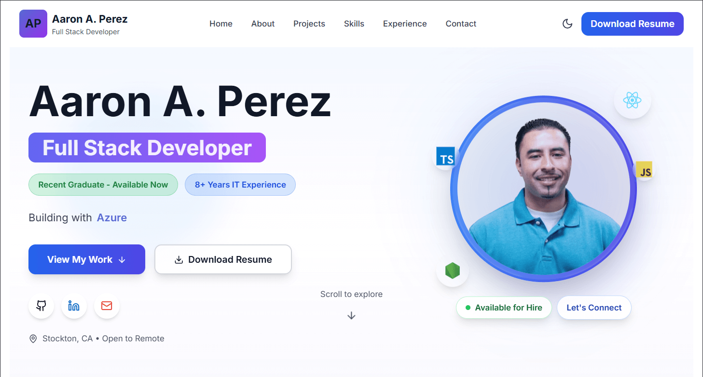
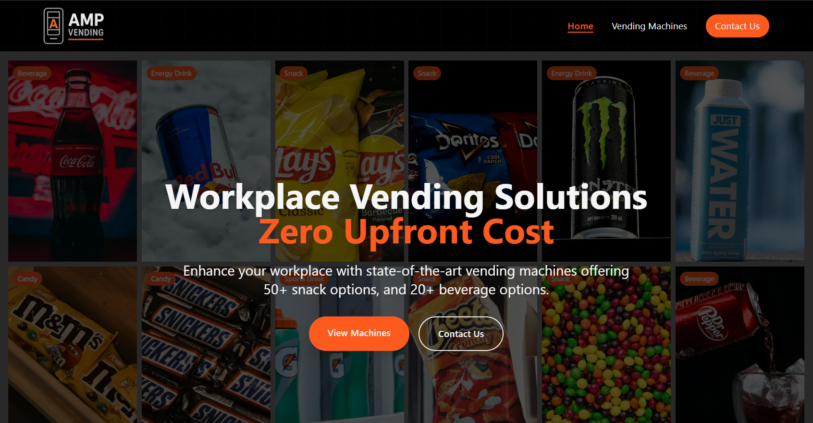
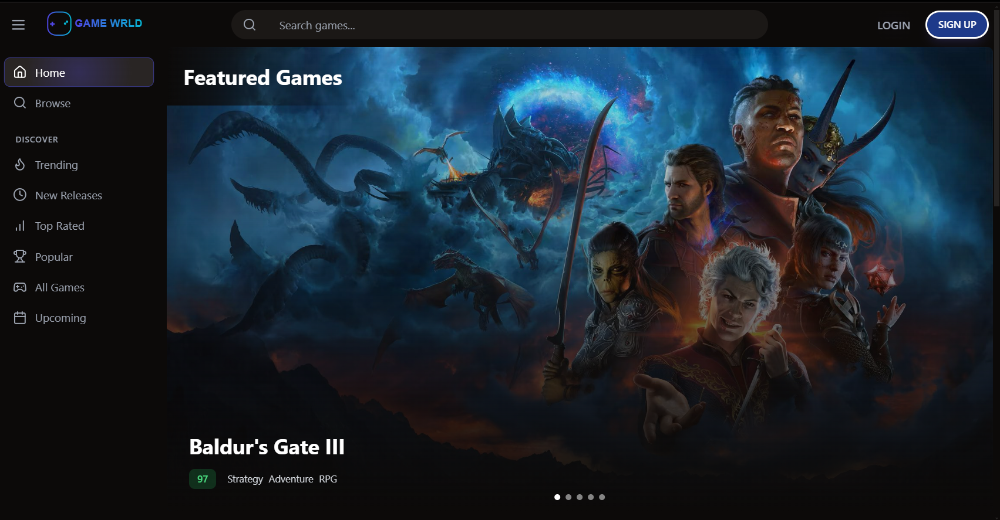
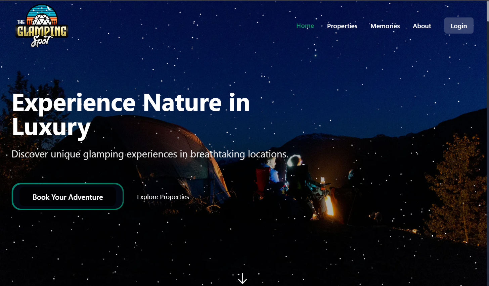
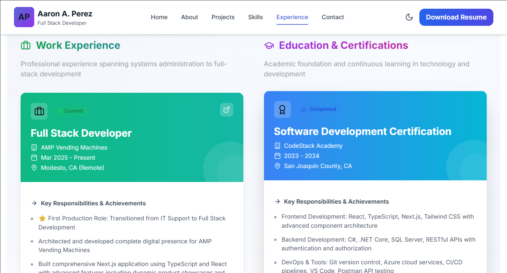

# Aaron A. Perez - Full Stack Developer Portfolio

[](https://nextjs.org/)
[](https://reactjs.org/)
[](https://www.typescriptlang.org/)
[](https://tailwindcss.com/)
[](https://opensource.org/licenses/MIT)

> A modern, performant, and accessible portfolio website showcasing full-stack development expertise with React, TypeScript, Next.js, and .NET. Built with performance optimization, SEO best practices, and WCAG AA accessibility compliance.

**Live Site:** [aaronaperez.dev](https://aaronaperez.dev) | **GitHub:** [@AaronAPerez](https://github.com/AaronAPerez)

---

## 📸 Screenshots

<div align="center">

### 🏠 Homepage Hero Section

*Modern, responsive hero section with dynamic tech stack display and glassmorphism effects*

### 💼 Featured Projects
<table>
  <tr>
    <td width="50%">
      
      <p align="center"><strong>AMP Vending Machines</strong><br/>Production Next.js Site</p>
    </td>
    <td width="50%">
      
      <p align="center"><strong>Game World Database</strong><br/>Full Stack Game Library</p>
    </td>
  </tr>
  <tr>
    <td width="50%">
      
      <p align="center"><strong>Expense Tracker</strong><br/>React + .NET Core App</p>
    </td>
    <td width="50%">
      
      <p align="center"><strong>The Glamping Spot</strong><br/>Tourism & Booking Website</p>
    </td>
  </tr>
</table>

### 🎨 Skills & Experience Timeline

*Interactive skills showcase with 40+ technologies and filterable categories*


*Professional experience and education timeline with detailed achievements*

### 📱 Responsive Design
<table>
  <tr>
    <td width="33%" align="center">
      
      <p><strong>Mobile View</strong></p>
    </td>
    <td width="33%" align="center">
      
      <p><strong>Tablet View</strong></p>
    </td>
    <td width="33%" align="center">
      
      <p><strong>Desktop View</strong></p>
    </td>
  </tr>
</table>

### 🌙 Dark Mode Support
<table>
  <tr>
    <td width="50%">
      
      <p align="center"><strong>Light Mode</strong></p>
    </td>
    <td width="50%">
      
      <p align="center"><strong>Dark Mode</strong></p>
    </td>
  </tr>
</table>

</div>

---

## 📋 Table of Contents

- [Screenshots](#-screenshots)
- [Overview](#-overview)
- [Key Features](#-key-features)
- [Tech Stack](#-tech-stack)
- [Project Structure](#-project-structure)
- [Getting Started](#-getting-started)
- [Performance & Optimization](#-performance--optimization)
- [Accessibility](#-accessibility)
- [SEO Strategy](#-seo-strategy)
- [Deployment](#-deployment)
- [Code Quality](#-code-quality)
- [Future Enhancements](#-future-enhancements)
- [Contact](#-contact)

---

## 🎯 Overview

This portfolio website serves as a comprehensive showcase of my skills as a **Full Stack Developer** specializing in modern web technologies. The site demonstrates my expertise in:

- **Frontend Development**: React, TypeScript, Next.js, Tailwind CSS
- **Backend Development**: C#, .NET Core, Node.js, RESTful APIs
- **DevOps & Cloud**: Azure, Vercel, CI/CD pipelines
- **Best Practices**: Performance optimization, accessibility (WCAG AA), SEO, responsive design

### 🎓 Professional Background

- **Full Stack Developer** at AMP Vending Machines (2025 - Present)
- **User Support Specialist** at San Joaquin County Office of Education (2017 - Present)
- **CodeStack Academy Graduate** - Full Stack Web Development (2023-2024)
- **Bachelor's Degree** in Information Systems & Cyber Security - ITT Technical Institute
- **Associate's Degree** in Network System Administration - ITT Technical Institute

---

## ✨ Key Features

### 🎨 Modern UI/UX
- **Glassmorphism Design**: Modern aesthetic with backdrop blur effects and gradient accents
- **Dark Mode Support**: Seamless theme switching with system preference detection
- **Smooth Animations**: Framer Motion animations with `prefers-reduced-motion` support
- **Responsive Design**: Mobile-first approach ensuring perfect display on all devices

### ⚡ Performance Optimized
- **Fast Load Times**: Sub-1s initial load with optimized bundle sizes
- **Image Optimization**: Next.js Image component with lazy loading and blur placeholders
- **Code Splitting**: Dynamic imports and route-based code splitting
- **Lighthouse Score**: 95+ across all metrics (Performance, Accessibility, SEO, Best Practices)

### ♿ Accessibility First
- **WCAG AA Compliant**: Full keyboard navigation and screen reader support
- **Semantic HTML**: Proper heading hierarchy and ARIA labels
- **Color Contrast**: Meets WCAG AA contrast ratios in all themes
- **Focus Management**: Visible focus indicators and logical tab order

### 🔍 SEO Optimized
- **Structured Data**: JSON-LD schema markup for rich search results
- **Meta Tags**: Dynamic OpenGraph and Twitter Card optimization
- **Sitemap & Robots.txt**: Automatic generation for search engine crawling
- **Performance Metrics**: Core Web Vitals optimization for search ranking

---

## 🛠️ Tech Stack

### Frontend Core
- **Next.js 15.3** - React framework with App Router
- **React 19.0** - UI component library
- **TypeScript 5.0** - Type-safe JavaScript
- **Tailwind CSS 3.4** - Utility-first CSS framework

### UI/Animation Libraries
- **Framer Motion 11.18** - Animation library
- **Lucide React** - Icon library
- **@tabler/icons-react** - Additional icon set
- **React Three Fiber** - 3D graphics with Three.js

### Development Tools
- **ESLint** - Code linting
- **PostCSS** - CSS processing
- **Autoprefixer** - CSS vendor prefixing
- **TypeScript** - Static type checking

### Deployment & Analytics
- **Vercel** - Hosting and deployment
- **@vercel/analytics** - Web analytics
- **Git** - Version control

---

## 📁 Project Structure

```
NextJS-Portfolio/
├── app/                        # Next.js App Router
│   ├── layout.tsx             # Root layout with providers
│   ├── page.tsx               # Homepage
│   ├── projects/              # Projects showcase pages
│   └── globals.css            # Global styles
├── components/
│   ├── sections/              # Page sections
│   │   ├── HeroSection.tsx           # Landing hero
│   │   ├── AboutSection/             # About me
│   │   ├── SkillsSection/            # Tech skills showcase
│   │   ├── ProjectsSection/          # Featured projects
│   │   ├── TimelineSection.tsx       # Work experience & education
│   │   └── ContactSection.tsx        # Contact information
│   ├── layout/                # Layout components
│   │   ├── Header.tsx               # Site header/navigation
│   │   ├── Footer.tsx               # Site footer
│   │   ├── Section.tsx              # Section wrapper
│   │   └── Container.tsx            # Content container
│   ├── ui/                    # Reusable UI components
│   │   ├── Button.tsx
│   │   ├── Card.tsx
│   │   ├── Badge.tsx
│   │   ├── Input.tsx
│   │   └── ThemeToggle.tsx
│   ├── accessibility/         # Accessibility utilities
│   ├── analytics/            # Analytics components
│   └── seo/                  # SEO components
├── context/                   # React Context providers
│   └── ThemeContext.tsx      # Dark mode theme provider
├── hooks/                     # Custom React hooks
│   └── useIntersectionObserver.ts
├── lib/                       # Utility functions
│   ├── utils.ts              # Helper utilities
│   └── constants.ts          # App constants
├── data/                      # Static data
│   ├── projects.ts           # Project information
│   ├── skills.ts             # Skills data
│   └── seoConfig.ts          # SEO configuration
├── public/                    # Static assets
│   ├── images/               # Image files
│   ├── icons/                # Icon files
│   └── resume/               # Resume PDF
└── types/                     # TypeScript type definitions
```

---

## 🚀 Getting Started

### Prerequisites

- **Node.js** 18.0 or higher
- **npm** 9.0 or higher (or **yarn**/**pnpm**/**bun**)
- **Git** for version control

### Installation

1. **Clone the repository**
   ```bash
   git clone https://github.com/AaronAPerez/NextJS-Portfolio.git
   cd NextJS-Portfolio
   ```

2. **Install dependencies**
   ```bash
   npm install
   # or
   yarn install
   # or
   pnpm install
   ```

3. **Run the development server**
   ```bash
   npm run dev
   # or
   yarn dev
   # or
   pnpm dev
   ```

4. **Open in browser**

   Navigate to [http://localhost:3000](http://localhost:3000) to see the site.

### Available Scripts

```bash
npm run dev      # Start development server
npm run build    # Build for production
npm run start    # Start production server
npm run lint     # Run ESLint
```

---

## ⚡ Performance & Optimization

### Performance Metrics
- **First Contentful Paint (FCP)**: < 1.0s
- **Largest Contentful Paint (LCP)**: < 2.0s
- **Cumulative Layout Shift (CLS)**: < 0.1
- **Time to Interactive (TTI)**: < 3.0s
- **Total Blocking Time (TBT)**: < 200ms

### Optimization Techniques
- ✅ Image optimization with Next.js Image component
- ✅ Font optimization with next/font
- ✅ Code splitting and lazy loading
- ✅ CSS optimization with Tailwind's purge
- ✅ Bundle size optimization
- ✅ Server-side rendering (SSR) for critical pages
- ✅ Static generation for maximum performance

---

## ♿ Accessibility

### WCAG AA Compliance
- ✅ Keyboard navigation support
- ✅ Screen reader compatibility
- ✅ Semantic HTML structure
- ✅ ARIA labels and descriptions
- ✅ Color contrast ratios > 4.5:1
- ✅ Focus indicators on all interactive elements
- ✅ Skip navigation links
- ✅ Responsive font sizing
- ✅ Alt text for all images

### Testing Tools Used
- **axe DevTools** - Automated accessibility testing
- **NVDA/JAWS** - Screen reader testing
- **Keyboard** - Manual keyboard navigation testing
- **Lighthouse** - Accessibility audits

---

## 🔍 SEO Strategy

### Technical SEO
- ✅ Semantic HTML5 structure
- ✅ Meta tags optimization (title, description, keywords)
- ✅ OpenGraph protocol for social sharing
- ✅ Twitter Card metadata
- ✅ JSON-LD structured data
- ✅ XML sitemap generation
- ✅ Robots.txt configuration
- ✅ Canonical URLs
- ✅ Mobile-friendly design

### Content SEO
- ✅ Relevant keywords: "full stack developer", "React developer", "TypeScript", "Next.js", "web development"
- ✅ H1-H6 heading hierarchy
- ✅ Descriptive alt text for images
- ✅ Internal linking structure
- ✅ Fast page load speeds (Core Web Vitals)

---

## 🌐 Deployment

### Vercel Deployment (Recommended)

1. **Connect to Vercel**
   - Push code to GitHub
   - Import project in [Vercel Dashboard](https://vercel.com/new)
   - Vercel auto-detects Next.js configuration

2. **Environment Variables**
   - No environment variables required for basic deployment
   - Add analytics keys if using third-party services

3. **Automatic Deployments**
   - Production: Deploys from `main` branch
   - Preview: Deploys from pull requests

### Manual Deployment

```bash
# Build the project
npm run build

# Start production server
npm run start
```

---

## 🧪 Code Quality

### Development Standards
- **TypeScript**: Strict mode enabled for type safety
- **ESLint**: Code linting with Next.js recommended rules
- **Component Architecture**: Modular, reusable components
- **Custom Hooks**: Logic separation and reusability
- **Error Boundaries**: Graceful error handling
- **Code Comments**: JSDoc documentation for complex functions

### Best Practices
- ✅ Component composition over inheritance
- ✅ Props validation with TypeScript interfaces
- ✅ Consistent naming conventions
- ✅ DRY (Don't Repeat Yourself) principle
- ✅ Performance optimization with React.memo and useMemo
- ✅ Responsive design with Tailwind breakpoints

---

## 🚧 Future Enhancements

### Planned Features
- [ ] **Blog Section**: Technical articles and tutorials
- [ ] **Case Studies**: Detailed project breakdowns
- [ ] **Contact Form**: Serverless form handling with validation
- [ ] **Newsletter**: Subscription functionality
- [ ] **Multi-language Support**: Internationalization (i18n)
- [ ] **CMS Integration**: Content management for easy updates
- [ ] **Analytics Dashboard**: Enhanced analytics visualization
- [ ] **PWA Features**: Progressive Web App capabilities
- [ ] **Testing Suite**: Unit and E2E tests with Jest/Cypress

### Performance Goals
- [ ] Lighthouse score 100 across all categories
- [ ] Sub-800ms page load times globally
- [ ] A+ security headers rating

---

## 📞 Contact

**Aaron A. Perez**
Full Stack Developer | React | TypeScript | Next.js | .NET | C#

- 🌐 **Portfolio**: [aaronaperez.dev](https://aaronaperez.dev)
- 💼 **LinkedIn**: [linkedin.com/in/aaronaperezdev](https://linkedin.com/in/aaronaperezdev)
- 🐙 **GitHub**: [github.com/AaronAPerez](https://github.com/AaronAPerez)
- 📧 **Email**: [aaperez06@gmail.com](mailto:aaperez06@gmail.com)
- 📱 **Phone**: (209) 470-2061
- 📍 **Location**: Stockton, CA (Open to Remote)

---

## 📄 License

This project is open source and available under the [MIT License](LICENSE).

---

## 🙏 Acknowledgments

- **Next.js Team** - For the amazing React framework
- **Vercel** - For seamless deployment and hosting
- **Tailwind CSS** - For the utility-first CSS framework
- **Framer Motion** - For smooth animations
- **CodeStack Academy** - For full stack development training
- **Open Source Community** - For countless libraries and resources

---

## 🌟 Show Your Support

If you found this portfolio helpful or inspiring, please consider:
- ⭐ **Starring** the repository
- 🐛 **Reporting** issues or bugs
- 💡 **Suggesting** new features
- 🔗 **Sharing** with others

---

<div align="center">

**Built with ❤️ by Aaron A. Perez**

[](https://aaronaperez.dev)
[](https://linkedin.com/in/aaronaperezdev)
[](https://github.com/AaronAPerez)

</div>
