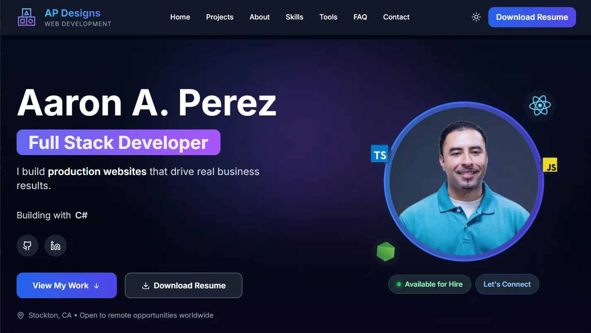

# Aaron Perez — Developer Portfolio

[](https://nextjs.org/)
[](https://react.dev/)
[](https://www.typescriptlang.org/)
[](https://tailwindcss.com/)

> Personal portfolio for Aaron Perez — Full Stack Developer specializing in local business websites, SEO-optimized web applications, and production-ready Next.js deployments.

---

## 🌐 Live Site

**[aaronaperez.dev](https://www.aaronaperez.dev)**

---

## 📸 Preview



---

## About This Project

This portfolio is itself a demonstration of my development standards: it targets Lighthouse 100 scores across all categories, follows WCAG 2.1 AA accessibility requirements, and uses a CSS custom property token system for consistent theming.

Built with Next.js 16.2 App Router, React 19, TypeScript strict mode, and Tailwind v3 with a custom brand color scale.

---

## 🌟 Featured Projects

| Project | Description | Live |
|---|---|---|
| **[AMP Vending Machines](https://github.com/AaronAPerez/AMP-Vending-Machines-Website)** | Full-stack local business site · Supabase · admin dashboard · multi-city SEO | [ampvendingmachines.com](https://ampvendingmachines.com) |
| **[Goldmine Communications](https://github.com/AaronAPerez/Goldmine-Communications-Construction-Website)** | Contractor business website with social media automation | Live |
| **[Balderas Concrete](https://github.com/AaronAPerez/balderas-concrete)** | Local service business · mobile-first · local SEO | Live |
| **Construction Estimating SaaS** | IMP takeoff tool · multi-layer architecture · React | In progress |

---

## 🛠️ Stack

- **Framework**: Next.js 16.2 App Router
- **Language**: TypeScript (strict mode)
- **Styling**: Tailwind CSS v3 + CSS custom properties
- **Deployment**: Vercel
- **Performance**: Lighthouse 100 target, Core Web Vitals optimized
- **Accessibility**: WCAG 2.1 AA, keyboard navigation, screen reader tested

---

## ⚡ Performance Goals

| Category | Target |
|---|---|
| Performance | 100 |
| Accessibility | 100 |
| Best Practices | 100 |
| SEO | 100 |

---

## 🚀 Run Locally

```bash
git clone https://github.com/AaronAPerez/NextJS-Portfolio.git
cd NextJS-Portfolio
npm install
npm run dev
```

Open [http://localhost:3000](http://localhost:3000).

---

## 📫 Contact

- **Email**: aaronperezdev@gmail.com
- **LinkedIn**: [linkedin.com/in/aaronaperezdev](https://www.linkedin.com/in/aaronaperezdev)
- **Location**: Stockton, California

---

*Built and maintained by [Aaron Perez](https://www.aaronaperez.dev) · AP Designs*
